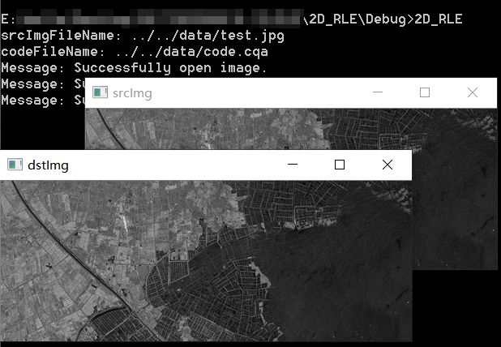

# 二维行程编码
## 文件说明
* `.\2D_RLE`文件夹中包括项目源代码、运行时所需的库以及可执行程序
* `.\data`文件夹中包括图像数据及两幅图像经二维行程编码得到的编码文件，编码文件的文件名对应图像的文件名，扩展名为`*.cqa`
## 环境配置
由于项目需要打开图像进行处理，所以需要安装opencv库，[opencv官网戳这里](https://opencv.org/){:target="_blank"}，配置可以参考各大论坛，[这里](https://zhuanlan.zhihu.com/p/51940986){:target="_blank"}有一个简单的免安装配置方法可以参考一下
## 运行说明
* 项目使用**Visual Studio 2013**编写，可以在该版本或更高版本VS上编译运行，或者可以直接运行`2D_RLE.exe`，也可以得到同样的结果
* 程序`2D_RLE.exe`可以接受没有参数，此时默认图片位置为`./data/test.jpg`，编码文件位置为`./data/code.cqa`；也可以接受2个参数作为**图像位置**和**编码文件位置**，请注意：在输入图片位置时请使用`/`而不是`\`来表示文件夹路径。例如在命令行里以下两种输入方式都是合法的：

	```bash
	2D_RLE
	```

	```bash
	2D_RLE input.bmp code.out
	```

* 程序`2D_RLE.exe`运行后
	* 首先读取一张图片
	* 然后通过二维行程编码进行压缩并写入编码文件
	* 再将编码文件读入并解码为图像
	* 最后在屏幕上显示原图像以及经编码解码处理后的图像
* 其中一次运行截图如下：



## 编码文件格式说明
* 编码文件为二进制文件，格式如下表：

|    含义   |rows |cols |index0|value0|index1|value1|index2|...|
|:---------:|:---:|:---:|:----:|:----:|:----:|:----:|:----:|---|
|**占用空间**|4字节| 4字节| 4字节| 1字节| 4字节 | 1字节| 4字节|...|

* 具体说明如下：
	* 编码文件中**第1-4字节**表示图像的**行数**
	* 编码文件中**第5-8字节**表示图像的**列数**
	* 编码文件中接下来**每5个字节**代表二维行程编码中的**一组数据{index,value}**
